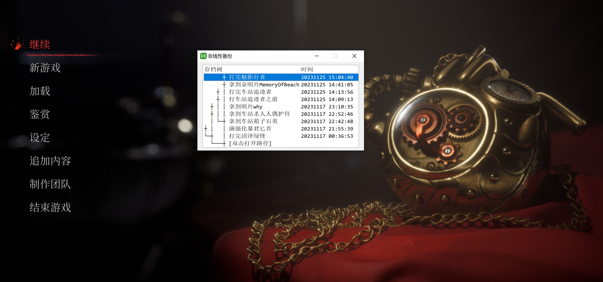
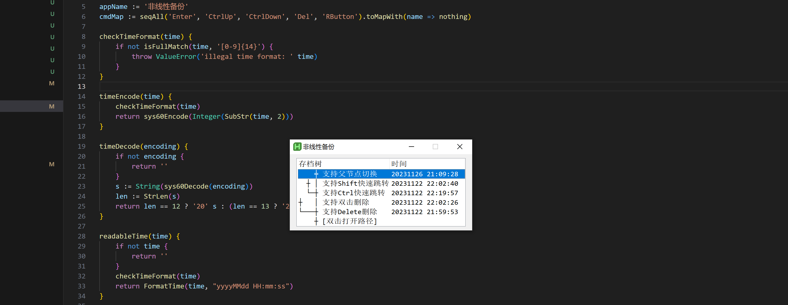
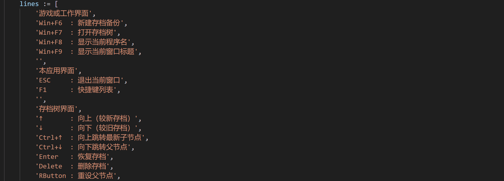

# 非线性备份

这是一个基于[AutoHotKey v2](https://www.autohotkey.com/docs/v2/)开发的极简Windows桌面应用，顾名思义，它提供了一种全新的以非线性的树形结构来管理存档的工作/游戏范式。其特点主要有三：

1. 窗口自动识别，在应用或游戏界面触发全局快捷键，自动弹出当前应用的备份管理界面。每个应用各顾各的存档，不需要统一的管理界面。
2. 备份好的存档以树形结构展开，每个存档都有一个父节点，一个父节点可以有多个子节点。适合游戏玩家、以及各种需要反复尝试和探索的创造性工作者。
3. 极简设计，无安装包和动态库依赖，仅一个1.2M大小的可执行文件，提供高度简洁的交互界面和丰富的快捷键操作。

它的英文叫Nonlinear Backup，刚好缩写为NB。



## 面向游戏佬

游戏佬都知道一句话，SL(Save and Load)大法好。我作为一个Steam游戏库100+，总时长数千小时的资深游戏佬，虽然也同意这句话，但总是被它较高的使用成本和极不便捷的使用体验而反复劝退。

把游戏存档在两个地方间手动复制来复制去，在我看来实在是不够优雅。虽然也有别的桌面应用能够帮助用户进行存档管理，但它们无一例外都是线性存档，只能靠户自行记忆或手动在文件夹名字上标记存档间的依赖关系。

众所周知，大型RPG游戏多分支剧情，肉鸽游戏不同Build，魂类游戏不同加点方案与武器强化，基地类游戏不同建筑方式，自动化游戏不同总线模式等各类游戏——它们都是天然以一个复杂的树状形式发展衍化的。如果我们能有一种手段，可以方便的将涉及重要分支的关键节点备份下来，并记录后续存档的分支关系。那各种游戏的深度游玩体验，可以说直接拉高一个档次。

尤其是肉鸽游戏，只要它能像noita那样支持局内存档，那借助这样的备份工具，立马变成RPG。


## 面向创造性工作者

所谓创造性工作，主要就是指像编程、论文写作这样，需要借助电脑对工作空间的代码、文档等进行反复修改尝试，并经过相对漫长的周期才能形成最终产出的工作。

编程的存档管理相对简单，行业的标准解决方案就是Git。但是Git只适用于纯文本的源代码管理，一旦涉及大量且频繁修改的图片等素材，Git用起来就会颇为吃力。

如果有一款软件，能够像Git那样记录提交历史，自由切换分支，并可随时查看各个存档的依赖关系，回退历史版本。那无疑能帮助创作者降低大量心智负担，鼓励他们进行更多探索和尝试。



## 功能演示

为了避免GIF文件过大，以下所有游戏存档操作演示都是借助VS Code编辑界面说明的，与在游戏主界面的操作方式完全一致。

### 新建存档备份

在游戏内，按 `Win+F6` 打开新建备份窗口，完成后按 `Enter` 即可保存当前最新存档，实现SL大法的S。中途按 `Ecs` 则直接退出。


### 查看存档树

在游戏内，按 `Win+F7` 打开存档树窗口，按 `↑↓` 切换存档，按 `Ctrl+↑↓` 跳转子存档与父存档。


### 查看快捷键提示

在新建界面和存档树查看界面，均可以使用 `F1` 打开快捷键提示。



### 恢复存档

当使用方向键或鼠标选定好存档后，就可以用回车 `Enter` 键恢复存档，也就是将备份存档替换覆写到原始存档的文件夹下。实现SL大法的L。

需要注意的是，很多游戏都只在关键存档点和退出游戏时才会将当前最新的游戏进度保存下来，所以若要使用本软件备份存档，请务必退出当前游戏到主菜单界面在进行操作。


### 删除存档

备份好的存档一般不建议删除，这是不可逆操作。但是当你的存档数量确实很多，且已发展到较为后期了。前期的存档可能已经失去价值。又或者两个存档备份时间相近，你只需要保留最新的存档。

这种时候，你都可以通过按 `Delete` 键来删除存档。


### 变更父存档

在创建新备份时，会自动关联所在的备份头（类似于Git中head的概念），将新存档标记为head的继承，然后将head指向新存档。但在某些场景下，例如肉鸽游戏新开了一局，新创建的备份再认为是head的继承就不合适了。这时候就需要用户将将它们拆开，也即取消父子存档的关联关系。

使用 `Ctrl`加鼠标左键选择两个存档，然后点击鼠标右键。如果二者原本就是直接的父子继承，则取消关系，将新存档重新关联到根节点下。如果二者原本不是父子关系，则重新绑定为父子。


## 如何使用

### 一、下载backup.exe

本项目首发[Gitee](https://gitee.com/wolray/nonlinear-backup)，使用GPL v2.0协议开源，在右侧发行版页面点击最新版下载即可。

### 二、创建一个备份专用文件夹

推荐在你的C盘或D盘上建一个名为"backup"或者"备份"的专用文件夹，用于存储所有游戏或应用的备份文件。

然后把你下载好的 `backup.exe`文件丢在这个文件夹里，它将以此作为工作根目录。

### 三、创建一个backup.ini配置文件

在已创建好的备份专用文件夹中，右键新建一个名为 `backup.txt` 的文本文件，并将其后缀名改为 `ini`。程序将识别文件内的配置信息，关联你所关心的游戏和存档路径。

配置文件的格式示例如下

```ini
; 本软件的本地开发源代码存档
Code:*nonlinear-backup* = D:\gitee\nonlinear-backup
; 游戏《匹诺曹的谎言》存档
LOP-Win64-Shipping = D:\SteamLibrary\steamapps\common\Lies of P\LiesofP\Saved\SaveGames\855023306
; 游戏《戴森球计划》存档
DSPGAME = C:\Users\ray\Documents\Dyson Sphere Program\Save, _lastexit_.dsv
```

#### 格式说明

每一行是一个配置（ `;`代表行注释）每个配置按照如下形式填写

```
程序名[:窗口标题] = 备份路径[,文件格式]
```

在等号左侧，首先要填的程序名可在进入程序后，按快捷键 `Win+F8`获取，页面会显示3秒并自动复制到剪贴板。对于游戏，窗口标题可以直接忽略不填，因为不同游戏程序名必然不同。但是对于一些写作之类的工作，如果你使用的是VS Code这样的通用编辑器，那有必要增加一个窗口标题限制，以便有针对性的备份。例如上面例子中的 `*nonlinear-backup*`，其中的 `*`号就是作为通配符，含义为标题中只要存在 `nonlinear-backup`，就视为该指定项目。窗口标题可通过快捷键 `Win+F9`获取。

而在等号右侧，备份路径需要用户自行确定，游戏的备份路径百度一下即可。例如Steam游戏通常的路径为

```
D:\SteamLibrary\steamapps\common\游戏名\...
```

在填写好备份路径之后，用户可以选择性的填写文件格式。`*.txt`代表仅限 `txt`后缀的文件，`abc*.txt`则代表以 `abc`开头且后缀为 `txt`的文件。例如游戏《戴森球计划》自带存档管理，它在存档目录下的所有文件都是不同的存档，你只需要备份其中默认的存档 `_lastexit_.dsv`即可。

在填写配置时，所涉及到的几个关键符号 `=`, `:`, `,`左右的空格留不留都可以。程序名和路径名务必保持准确。

#### 启动程序

当配置完成 `backup.ini` 文件后，请点击同目录下的 `backup.exe` 程序将其激活。之后它就将以用户完全无感的方式运行于系统后台，只在你触发新建备份(`Win+F6`)和打开存档树(`Win+F7`)这两个快捷键时，才会弹出相应的交互界面。

如果你对 `backup.ini` 进行了改动，还请别忘了重新启动下 `backup.exe`。

另外为了方便，建议可以给 `backup.exe` 创建一个快捷方式并放入Windows的启动项里，这样每次开机就会自动激活。工作游戏，随心备份。

启动项方式添加方式：`Win+R` 打开系统运行窗口，输入 `shell:startup` 弹出一个文件夹，将需要开机启动的程序快捷方式放入其中即可。

## 关于本项目

本项目完全由AutoHotKey v2（以下简称为AHK）的脚本代码开发而成，全部代码量不足1500行，其中还包含一个我写的500来行的流式编程库，项目最终编译而成的可执行程序 `backup.exe`，大小仅1.2M。

#### 关于流式编程

本项目中采用了大量的流式编程API，其原理以及更全面的Java实现见 [wolray/seq: A powerful generator-like streaming API for Java](https://github.com/wolray/seq)
